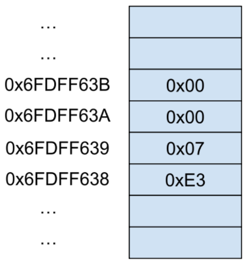
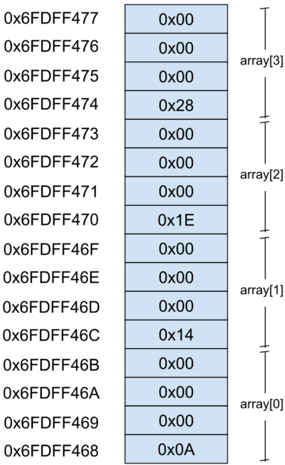
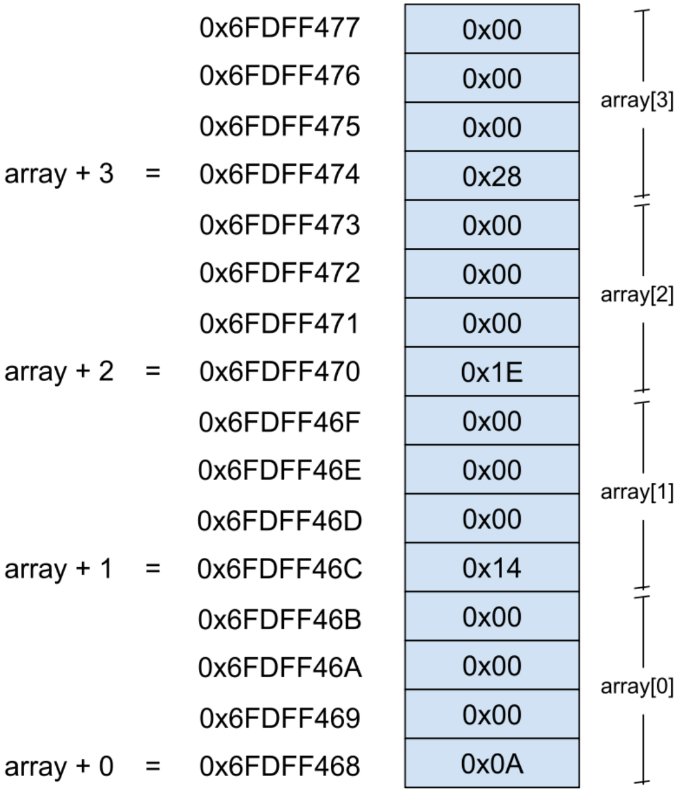

# Memória e Alocação Dinâmica

Esta seção contém códigos e exemplos relacionados ao uso da memória e sua manipulação na linguagem de programação C.
A capacidade de alocar e desalocar memória livremente é um poder extremamente importante, porém, ao mesmo tempo, perigoso, tendo em vista que o mal manejamento da memória pode levar à formação de _memory le outros comeaks_, e de, consequentemente, severos problemas à performance de aplicações desenvolvidas.

### Exemplos:

Esta seção contém exemplos práticos de como alocar e desalocar memória em diferentes situações contextos. Os códigos estão comentados para facilitar a compreensão e servir como referência.

## Conteúdo

-   Nos computadores, variáveis criadas em linguagens de programação são alocadas na memória de forma sequencial.
    Portanto, diferentes tipos de variável ocupam diferentes quantidades de byes em memória, em C, por exemplo:

    1. CHAR (1 byte)
    2. INT (4 bytes)
    3. FLOAT (4 bytes)
    4. POINTER (8 bytes)

-   Para alocar dados em memória, declaramos-as no código

```c
char letter = 'A'; // 0x41
int year = 2019; // = 0b 00000000 00000000 00000111 11100011
```



-   Ao declarar uma array de n posições, cada elemento também é armazenado sequencialmente.

```c
int array[4];

array[0] = 10;
array[1] = 20;
array[2] = 30;
array[3] = 40;
```



## Aritmética de Ponteiros

-   A aritmética de ponteiros inclui operações básicas, como adição e subtração. <br /> Quando um número inteiro é adicionado a um ponteiro, o ponteiro é movido para frente na memória pelo número de bytes correspondente ao tamanho do tipo de dados apontado. <br /> Da mesma forma, a subtração move o ponteiro para trás.



-   Dessa forma, todas as seguinte operações possuem o mesmo resultado:

```c
array + 1 = ?
array[1] = ?
*(array + 1) = ?
```

## Alocação de memória dinâmica

-   Ao criarmos um array, a quantidade de elementos que podem ser inseridos é fixa, ou seja, não se altera.

```c
float grades[60];
```

-   Como não existe forma fácil ou direta de redimensionar um array, quando necessário, mais memória é requerida no `runtime` (enquanto a aplicação está rodando)

-   Então, supondo que precisamos armazenar 60 notas em variáveis `float` de 4 bytes, será necessário fazer o seguinte:

```c
#include <stdlib.h>

int *array;
array = malloc(60 * 4) // ou malloc(60 * sizeof(float))

// Após executar esse código, haverão 60 posições contínuas para armazenar 60 notas em 240 bytes
```

-   Com a função `malloc`, o espaço necessário para criar um array é alocado e operações podem ser realizadas em seguida:

```c
int *pointer = malloc(4 * sizeof(int));

pointer[0] = 10;
pointer[1] = 20;
*(pointer + 2) = 30;
*(pointer + 3) = 40;
```

## Memory leak

-   Acontece quando um programa consome memória, mas não a desaloca de volta ao sistema operacional

```c
void f()
{
    int *v;
    v = malloc(540 * sizeof(int));
    return; // não há uso da função free() para liberar a memória alocada
}
```

<br />

> [!NOTE]
> No caso de problemas ou erros com algum comentário ou exemplo nesse repositório, abra um [issue](https://github.com/theduardomaciel/cc-ed/issues/new) ou [sugira uma sugestão](https://github.com/theduardomaciel/cc-ed/fork) para que o conteúdo esteja sempre o mais correto!

<br />

## Links úteis
