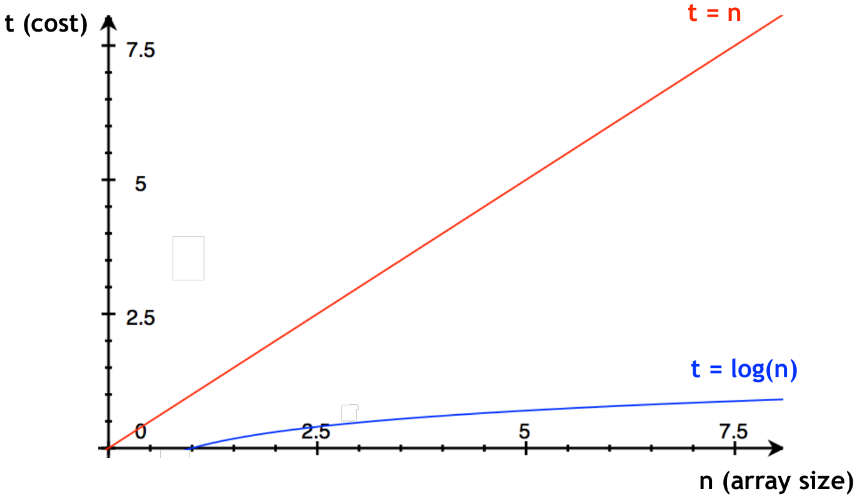

# Eficiência de Algoritmos e Notação Big O

Esta seção aborda a eficiência de algoritmos e a notação Big O, conceitos cruciais para avaliar o desempenho e a escalabilidade dos algoritmos em diferentes cenários. <br />
Compreender esses tópicos é fundamental para projetar soluções eficientes e otimizadas.

## Conteúdo

### O que torna um algoritmo "melhor"?

-   Ao compararmos os seguintes trechos de códigos, responsáveis por realizar a soma dos números até um dado `n`, percebe-se que um é melhor que o outro, pois requer **menos tempo** para executar!

```c
int sum_integers(int n)
{
    int sum = 0;
    for (int i = 1; i <= n; i++) { // O loop custa bastante performance
        sum = sum + i;
    }
    return sum;
}
```

```c
int sum_integers(int n)
{
    return (n + 1) * n / 2; // solução de Gauss
}
```

-   Por isso, devemos nos preocupar com dois recursos: **tempo** e **espaço**



## T(n)

-   Equivale ao **tempo de execução** do código, onde $n$ é o tamanho do _input_ (geralmente um _array_)

-   Ao supor um programa que multiplica dois números com uma quantidade $n$ de dígitos, temos:

    1.  **$117.65 n^2$** milissegundos em um _microcomputador_
    2.  **$5.08n^2$** milissegundos em um _mainframe_

-   Tendo em vista a dificuldade de estimar tempos em computadores diferentes, apenas dizemos que o algoritmo é proporcional a $n^2$

    -   Cada máquina somente tem seu tempo de execução alterado devido a constantes

-   Como regra, temos o seguinte:

    1.  Não se preocupar com múltiplos que são constantes
    2.  Se preocupar com as maiores estimativas (**piores casos**)

-   É de se notar que algumas declarações **não dependem do tamanho do array**, e, portanto, possuem um tempo de execução **constante = 1**.

```c
a = v[100]; // Acessar um elemento de uma array não depende do seu tamanho
```

-   À título de exemplo, a **Busca Linear** depende do tamanho do array, portanto, o `tempo de execução` será proporcional a esse tamanho.

## Notação de Big O

-   É utilizada para descrever o efeito do tamanho de determinado _input_ na performance de um algoritmo. <br />
    Ou seja, a notação de Big O é utilizada para **medir a eficiência de um algoritmo**.

-   Ao analisar o tempo de execução de um algoritmo, devemos nos preocupar com o **pior caso**.

-   A notação de Big O não é utilizada para medir o tempo de execução de um algoritmo, e sim, para **medir a rapidez com que o tempo de execução aumenta** à medida que o tamanho do _input_ aumenta.

| Declaração    | Big O       |
| ------------- | ----------- |
| a = v[20]     | $O(1)$      |
| Busca Linear  | $O(n)$      |
| Busca Binária | $O(log(n))$ |

-   Tendo em vista a definição de Big O, algumas funções serão simplificadas:

$$
    n + 1 = O(n) \\

    \ \\

    f(n) = n + 1 \ \ \ \ \ \
    g(n) = n \\

    \ \\

    n + 1 ≤ c . n \\
    n + 1 ≤ 2.n \\
    f(n) = O(n), \\

    \ \\

    c = 2; \ \  n_0 = 1
$$

-   Dessa forma, a notação de Big O é utilizada para descrever o **limite superior assintótico** do tempo de execução de um algoritmo, ou seja, o tempo de execução **nunca será maior** que o tempo de execução descrito pela notação de Big O.

-   Logo, se $f(n)$ é a complexidade do algoritmo, em função de $n$, e $g(n)$ é o limite superior dessa complexidade, o tempo para um problema de tamanho $n$ nunca será pior que $g(n)$

## Piores casos e constantes

-   Expressões de Big O não possuem constantes, pois, para o Big O, quando $n$ torna-se grande o suficiente, constantes não importam. Logo,

$$
    t(n) = log_2(n + 1)
    \ \\ \Downarrow	 \ \\
    t(n) = log(n)
$$

### Por que remover o +1?

Constantes, como o $+1$ na função $t(n) = log_2(n + 1)$, são frequentemente ignoradas porque não afetam a ordem de grandeza da função no contexto assintótico, referente à definição de Big O.

Em outras palavras, à medida que $n$ se torna muito grande, a diferença entre $log_2(n)$ e $log_2(n + 1)$ se torna insignificante.

### Por que ignorar a base 2?

Ao analisar a notação Big O, a base do logaritmo é frequentemente ignorada porque a mudança de base de um logaritmo para outro é apenas um fator constante.

Em resumo, mudar a base de um logaritmo corresponde à multiplicar por uma constante, no entanto, sabe-se que Big O não considera a multiplicação por constantes.
Logo, a base não faz diferença nesses casos.

$$
    log_2(n) = O(log(n)) \\ \big\downarrow	 \ \\
    log_b(n) = O(log_c(n)) \\ \ \\
    1.\\
    n = c^{log_c(n)} \\
    2.\\
    log_b(n) = log_b(c^{log_c(n)}) \\
    3.\\
    log_b(n) = log_c(n) \ . \ log_b(c)
$$

1. Utilizamos a propriedade fundamental do logaritmo ($a^{log_a(x)} = x$)
2. Aplicamos o logaritmo de base $b$ em ambos os lados da expressão do passo 1.
3. Utilizamos a propriedade dos logaritmos $log_a(b^c) = c \ . \ log_a(b)$ para simplificar a expressão.

Dessa forma, tal manipulação algébrica nos mostra que logaritmos de diferentes bases dependem unicamente de constantes, as quais são ignoradas pelo conceito de Big O.

## Regras para o Big O

### Regra 1

Para qualquer constante $c$,
$$c \ . \ f(n) = O(f(n))$$

### Regra 2

Se $f(n) = O(g(n))$ e $g(n) = O(h(n))$, então
$$ f(n) = O(h(n))$$

#### Prova matemática

$f(n) = O(g(n))$ possui constantes $c_1$ e $n_1$, portanto,

$$f(n) ≤ c_1 \ . \ g(n) \ \ \ [1]$$
$g(n) = O(h(n))$, possui constantes $c2$ e $n2$, portanto,

$$g(n) ≤ c_2 \ . \ h(n) \ \ \ [2]$$

Substituindo [2] em [1], $$f(n) ≤ c_2 \ . \ (c_2 \ . \ h(n))$$
sendo $n_3$ o máximo de $n_1$ e $n_2$.

Consideremos $c_3 = c_1 \ . \ c_2$, então para todo $n > n_3$, temos que
$$f(n) ≤ c_3 \ . \ h(n)$$
o que é, pela definição, $f(n) = O(h(n))$

### Regra 3

$$f1(n) + g1(n) = O(max{f2(n), g2(n)})$$

<br />

> [!NOTE]
> No caso de problemas ou erros com algum comentário ou exemplo nesse repositório, abra um [issue](https://github.com/theduardomaciel/cc-ed/issues/new) ou [sugira uma sugestão](https://github.com/theduardomaciel/cc-ed/fork) para que o conteúdo esteja sempre o mais correto!

<br />

## Links úteis

-   [pendente]
